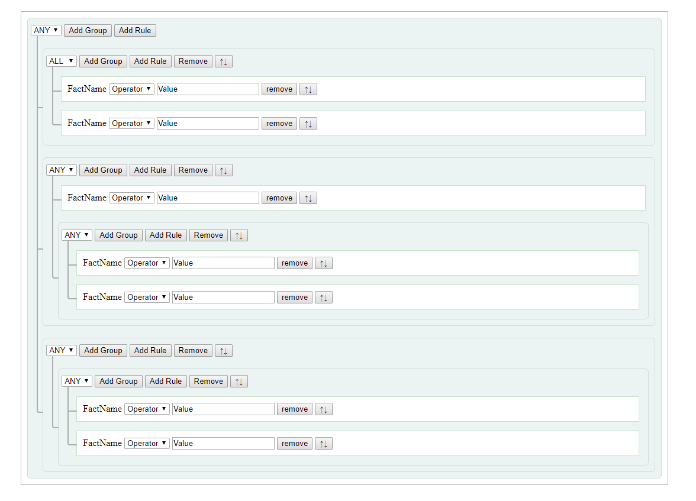

# json-rules-engine-ui
example rule definition ui for json-rules-engine
DEMO https://ozanerturk.github.io/json-rules-engine-ui/

From the begging, do not forget, it is only an example.

This example uses CND links, when you clone this repository you could see it isn't working. Consider to check cdn links.

It has very sensitive css definitions. So, be carefull when you play with design.

I would be realy glad if there is someone who can simplfy this example. This is what I can do for now :)

